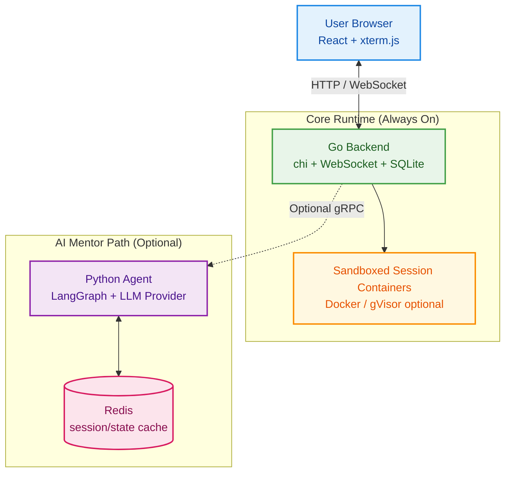

# SHSH Playground

Linux learning playground with isolated terminal environments and a silence-first AI mentor.

## What This Is

- **Browser terminal** — Full Linux shell in your browser (xterm.js)
- **AI mentor** (optional) — Observes your terminal, nudges when you're stuck, never gives answers outright
- **Sandboxed containers** — Each session runs in an isolated Docker container
- **Python agent** — LangGraph-powered AI agent service over gRPC (optional)

## Quick Start

### Prerequisites

- [Docker](https://docs.docker.com/get-docker/) (with Docker Compose)
- Optional: A [Google AI API key](https://aistudio.google.com/apikey) (free) for AI mentor features

### Run Without AI (Terminal Only)

```bash
# 1. Clone
git clone https://github.com/ashureev/shsh-labs.git
cd shsh-labs

# 2. Build
docker compose build
docker compose --profile build build   # builds the playground container image

# 3. Run
docker compose up -d
```

Open **http://localhost:8080** — the terminal works immediately without any API keys.

### Enable AI Mentor (Optional)

```bash
# Copy env file and add your API key
cp .env.example .env
# Edit .env — set GOOGLE_API_KEY=your_key_here

# Start with AI profile
docker compose --profile ai up -d

# Restart backend to connect to python-agent (one-time when enabling AI)
docker compose restart backend
```

## Architecture



The AI mentor is **completely optional** — the Go backend detects if the Python Agent is available and gracefully disables AI features when it's not configured.

## Development

### Backend (Go)

```bash
go build ./cmd/server
go test ./...
```

### Frontend (React + Vite)

```bash
npm install
npm run dev          # http://localhost:5173 (proxies API to :8080)
npm run lint
```

### Full Stack (Docker)

```bash
docker compose up --build
```

## Configuration

All configuration is via environment variables. See [`.env.example`](.env.example) for the full list.

| Variable | Required | Default | Description |
|----------|----------|---------|-------------|
| `GOOGLE_API_KEY` | No | — | Google AI API key (for AI mentor; terminal works without it) |
| `PORT` | No | `8080` | Backend port |
| `LLM_PROVIDER` | No | `gemini` | AI provider (`gemini` or `openrouter`) |
| `LLM_MODEL` | No | `gemini-2.5-flash-lite-preview-06-2025` | Model name |
| `CONTAINER_RUNTIME` | No | _(empty = default Docker)_ | Set to `runsc` for gVisor |
| `CONVERSATION_LOG_ENABLED` | No | `true` | Enable per-user JSON transparency logs |
| `CONVERSATION_LOG_DIR` | No | `./data/logs/conversations` | Base directory for per-user/session NDJSON files |

## Conversation Logs

When AI is enabled, the backend writes transparency logs to:

`data/logs/conversations/<user_id>/<session_id>.ndjson`

Each line is a JSON event that includes:
- `chat_user_message`
- `chat_assistant_message`
- `proactive_message`
- exact `content_raw` plus readable `content_clean`

Set `CONVERSATION_LOG_ENABLED=false` to disable logging.

## License

[MIT](LICENSE)
