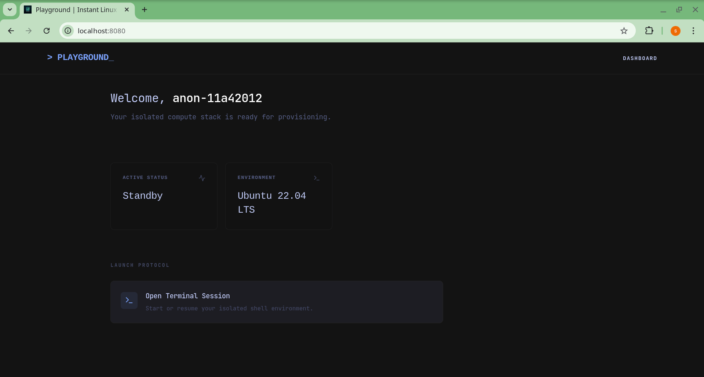
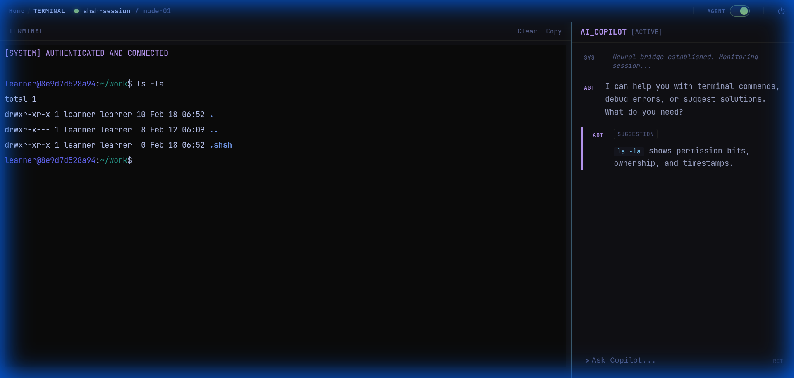
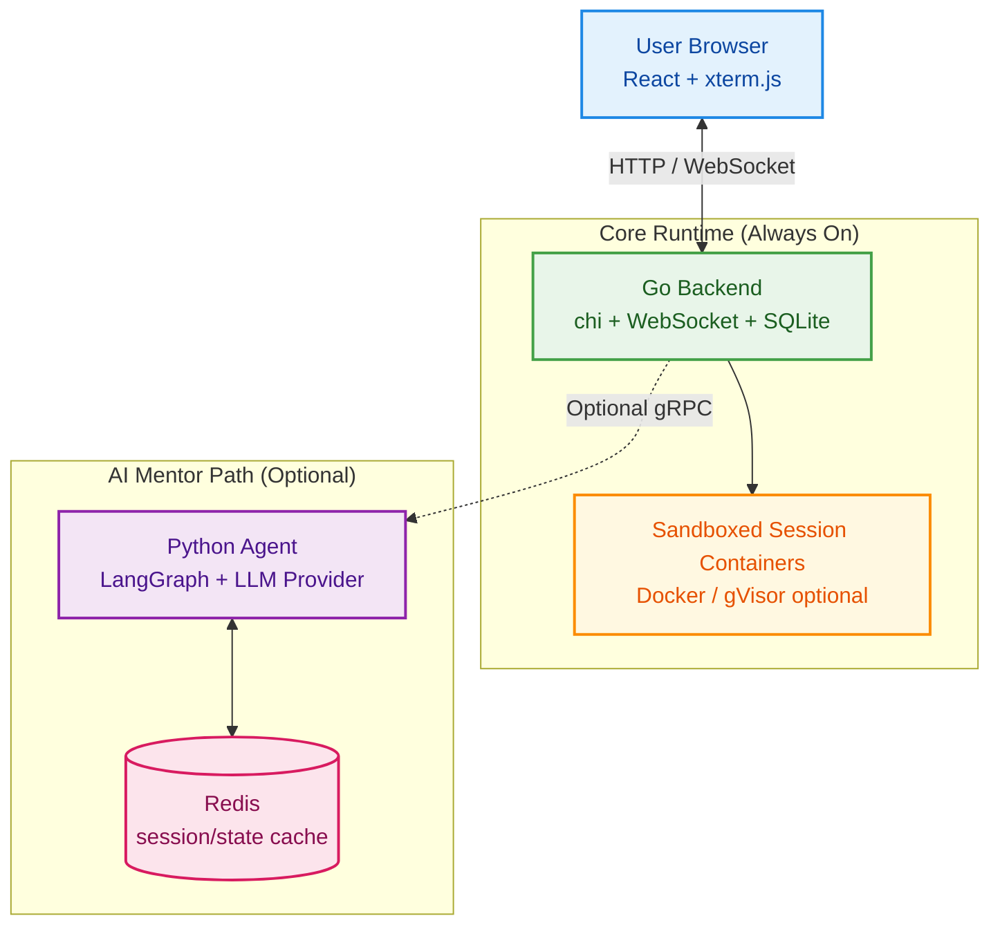

# SHSH Playground

Practice Linux in your browser — no setup, no local installs. Each session runs in an isolated container so you can't break anything.

<video src="docs/assets/demo.mp4" width="100%" autoplay loop muted playsinline controls></video>


## What you get

| Feature                            | Always available?               |
| ---------------------------------- | ------------------------------- |
| Full Linux terminal in the browser | ✅ Yes                           |
| Isolated container per session     | ✅ Yes                           |
| AI mentor that nudges (not spoils) | Optional — needs a free API key |

The AI mentor watches your terminal and gives hints when you're stuck. It won't just hand you the answer.

### Interface





------

## Quickstart

### 1 — Terminal only (no API key needed)

```bash
git clone https://github.com/ashureev/shsh-labs.git
cd shsh-labs

docker compose build
docker compose --profile build build   # builds the sandbox container image

docker compose up -d
```

Open **http://localhost:8080** and start typing.

### 2 — With AI mentor (free Google AI key)

Get a key at [aistudio.google.com/apikey](https://aistudio.google.com/apikey), then:

```bash
cp .env.example .env
# Open .env and set: GOOGLE_API_KEY=your_key_here

docker compose --profile ai up -d
docker compose restart backend   # connect backend to the AI agent (one-time)
```

------

## How it works

```
Browser (React + xterm.js)
    ↕ HTTP / WebSocket
Go Backend  →  Sandbox containers (Docker)
    ↕ gRPC (optional)
Python AI Agent (LangGraph)  ↔  Redis
```

The backend automatically disables AI features if no agent is running — nothing breaks.

------

## Configuration

All options are set via environment variables. See `.env.example` for the complete list of available configuration options.

### Quick Reference

| Variable                   | Default                                 | What it does                           |
| -------------------------- | --------------------------------------- | -------------------------------------- |
| `GOOGLE_API_KEY`           | —                                       | Enables the AI mentor                  |
| `PORT`                     | `8080`                                  | Backend port                           |
| `LLM_PROVIDER`             | `gemini`                                | AI provider (`gemini` or `openrouter`) |
| `LLM_MODEL`                | `gemini-2.5-flash-lite-preview-06-2025` | Model to use                           |
| `CONTAINER_RUNTIME`        | *(Docker default)*                      | Set `runsc` for gVisor sandboxing      |
| `CONVERSATION_LOG_ENABLED` | `true`                                  | Log AI conversations to disk           |
| `CONVERSATION_LOG_DIR`     | `./data/logs/conversations`             | Where logs are saved                   |

### Full Configuration

For all available options including timeouts, resource limits, rate limiting, and retry settings, refer to `.env.example` which includes documentation for each variable.

------

## Development

```bash
# Backend (Go)
go build ./cmd/server
go test ./...

# Frontend (React + Vite)
npm install
npm run dev        # http://localhost:5173, proxies API to :8080

# Full stack
docker compose up --build
```

------


## Architecture




## License

[MIT](LICENSE)
