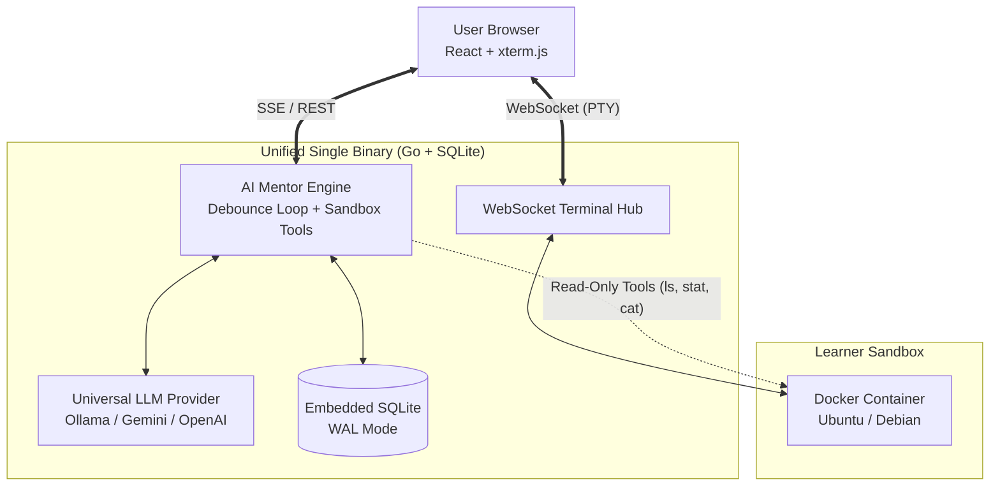

# SHSH 2.0 Playground

Practice Linux in your browser with an isolated Docker sandbox and an **ambient, tool-assisted AI mentor** powered by local or cloud models (Ollama, Gemini, OpenAI, Claude, OpenRouter).

---

## What You Get

| Feature | Always Available? | Details |
| :--- | :--- | :--- |
| **Full Linux Terminal in Browser** | ✅ Yes | `xterm.js` connected over low-latency WebSockets with PTY support |
| **Isolated Docker Sandbox** | ✅ Yes | Dedicated container with persistent workspace (`/home/learner/work`) |
| **Ambient AI Mentor** | ✅ Yes | Watches errors, gives progressive pedagogical hints (never spoils) |
| **Sandbox Inspection Tools** | ✅ Yes | Mentor inspects permissions, directories, and processes before answering |
| **Universal LLM Engine** | ✅ Yes | Works **100% offline with Ollama** or with Gemini, OpenAI, Anthropic |

---

## Quickstart

### Option 1: Run with Docker Compose (Recommended)

```bash
git clone https://github.com/ashureev/shsh-labs.git
cd shsh-labs

# 1. Build the playground learner image
docker compose --profile build build

# 2. Start the unified playground server
docker compose up -d
```

Open **http://localhost:8080** and start practicing!

### Option 2: Run Directly from Source

```bash
# 1. Build frontend
npm install
npm run build

# 2. Run single Go binary
go run ./cmd/server
```

---

## AI Mentor & LLM Setup

You can configure the AI mentor via `.env` or interactively in the web UI using the **⚙ Settings** button in the top right.

### 1. Offline Local Mode (Ollama)
Install [Ollama](https://ollama.com) and pull a model:
```bash
ollama run llama3.2
# Or: ollama run qwen2.5-coder
```
SHSH automatically connects to `http://localhost:11434/v1` by default!

### 2. Google Gemini (Free Tier)
Get a free API key at [aistudio.google.com/apikey](https://aistudio.google.com/apikey):
```bash
cp .env.example .env
# Set GOOGLE_API_KEY=your_key_here
```

### 3. OpenAI / Anthropic / OpenRouter
Set `OPENAI_API_KEY` or `OPENROUTER_API_KEY` in `.env` or via the in-app settings modal.

---

## Architecture (SHSH 2.0)


```mermaid
flowchart TB
    U[User Browser<br/>React + xterm.js]

    subgraph Core["Unified Single Binary (Go + SQLite)"]
        WS[WebSocket Terminal Hub]
        Tutor[AI Mentor Engine<br/>Debounce Loop + Sandbox Tools]
        LLM[Universal LLM Provider<br/>Ollama / Gemini / OpenAI]
        DB[(Embedded SQLite<br/>WAL Mode)]
    end

    subgraph Sandbox["Learner Sandbox"]
        C[Docker Container<br/>Ubuntu / Debian]
    end

    U <== WebSocket (PTY) ==> WS
    U <== SSE / REST ==> Tutor
    WS <--> C
    Tutor <--> LLM
    Tutor -. Read-Only Tools (ls, stat, cat) .-> C
    Tutor <--> DB
```

---

## License

[MIT](LICENSE)
