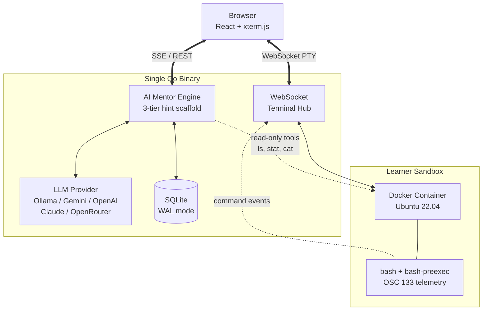

# shsh-labs

A browser-based Linux playground for learning shell and bash scripting — with an AI mentor that watches what you type and helps when things go wrong.

> Built for people who want to practice Linux without breaking their own machine.

---

## What It Does

You get a real Linux terminal in your browser. Every command runs inside an isolated Docker container, so you can try anything safely.

When you make a mistake — wrong command, permission error, syntax issue — the AI mentor notices automatically. It reads your command history, checks your working directory and file permissions, then gives you a hint. It won't just hand you the answer; it guides you to figure it out.

---

## Features

- **Real terminal in the browser** — powered by xterm.js over WebSockets with full PTY support
- **Isolated sandbox** — each user gets their own Docker container with a persistent workspace
- **AI mentor** — watches your commands and explains errors without spoiling the solution
- **Container inspection** — the mentor can look inside your sandbox (files, permissions, processes) before answering
- **Works offline** — connects to [Ollama](https://ollama.com) locally with no API keys needed
- **Cloud LLMs too** — Gemini, OpenAI, Anthropic, OpenRouter all supported
- **Single binary** — the entire backend is one Go binary with an embedded SQLite database

---

## Architecture


```mermaid
flowchart TB
    Browser["Browser\nReact + xterm.js"]

    subgraph Backend["Single Go Binary"]
        WS["WebSocket\nTerminal Hub"]
        Tutor["AI Mentor Engine\n3-tier hint scaffold"]
        LLM["LLM Provider\nOllama / Gemini / OpenAI\nClaude / OpenRouter"]
        DB[("SQLite\nWAL mode")]
    end

    subgraph Sandbox["Learner Sandbox"]
        Container["Docker Container\nUbuntu 22.04"]
        Shell["bash + bash-preexec\nOSC 133 telemetry"]
    end

    Browser <== "WebSocket PTY" ==> WS
    Browser <== "SSE / REST" ==> Tutor
    WS <--> Container
    Container --- Shell
    Shell -. "command events" .-> WS
    Tutor <--> LLM
    Tutor -. "read-only tools\nls, stat, cat" .-> Container
    Tutor <--> DB
```

### How the AI mentor works

1. Every command you run emits an OSC 133 shell integration event via `bash-preexec` hooks in the container
2. The backend captures the command, exit code, working directory, and duration from the PTY byte stream
3. When something fails, the mentor gets context: your last 15 commands, the error, and whatever it finds by inspecting your sandbox files and permissions
4. It responds with a progressive hint — starts small, only reveals more if you stay stuck

---

## Quickstart

**Requirements:** Docker, Docker Compose

```bash
git clone https://github.com/ashureev/shsh-labs.git
cd shsh-labs

# Build the learner sandbox image
docker compose --profile build build

# Start everything
docker compose up -d
```

Open **http://localhost:8080**

---

## AI Setup

### Offline with Ollama (no API key needed)

Install [Ollama](https://ollama.com), then pull a model:

```bash
ollama pull llama3.2
# or: ollama pull qwen2.5-coder
```

SHSH connects to Ollama automatically on `http://localhost:11434`. No configuration needed.

### Cloud models

Copy `.env.example` to `.env` and set your key:

```bash
cp .env.example .env
```

| Provider | Variable |
|---|---|
| Google Gemini | `GOOGLE_API_KEY` |
| OpenAI | `OPENAI_API_KEY` |
| Anthropic | `ANTHROPIC_API_KEY` |
| OpenRouter | `OPENROUTER_API_KEY` |

You can also configure everything from the **⚙ Settings** panel inside the app — no need to touch `.env`.

---

## Tech Stack

| Layer | Technology |
|---|---|
| Frontend | React, xterm.js, Framer Motion |
| Backend | Go 1.24, single binary |
| Database | SQLite (WAL mode, embedded) |
| Terminal | Docker exec PTY, bash-preexec, OSC 133 |
| AI | Universal provider client (Ollama / OpenAI-compatible API) |

---

## License

[MIT](LICENSE)
